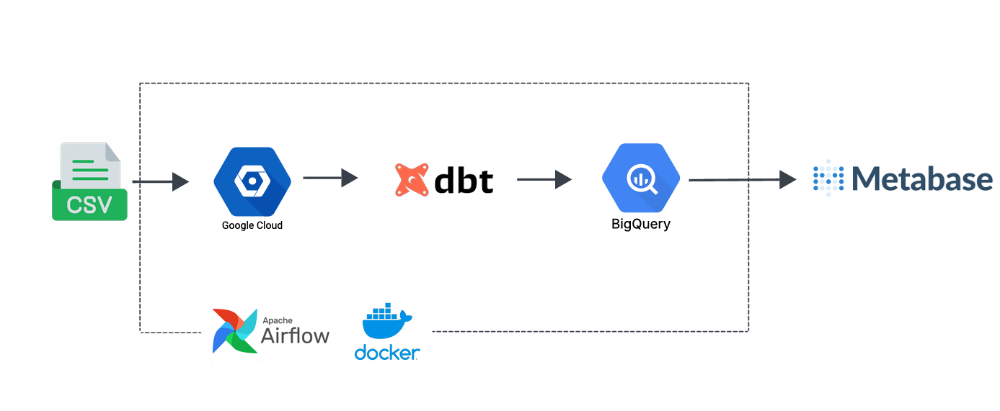
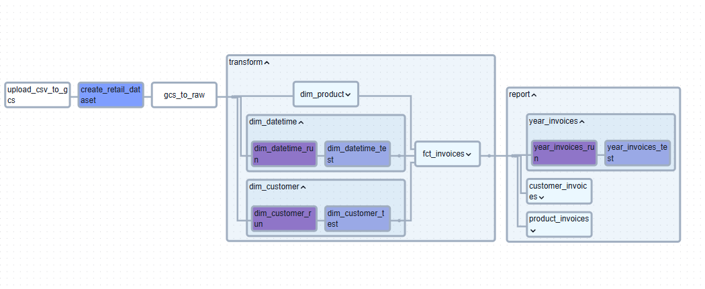
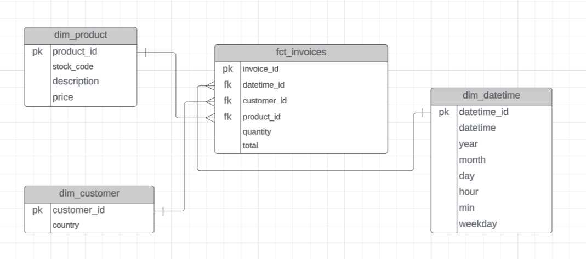
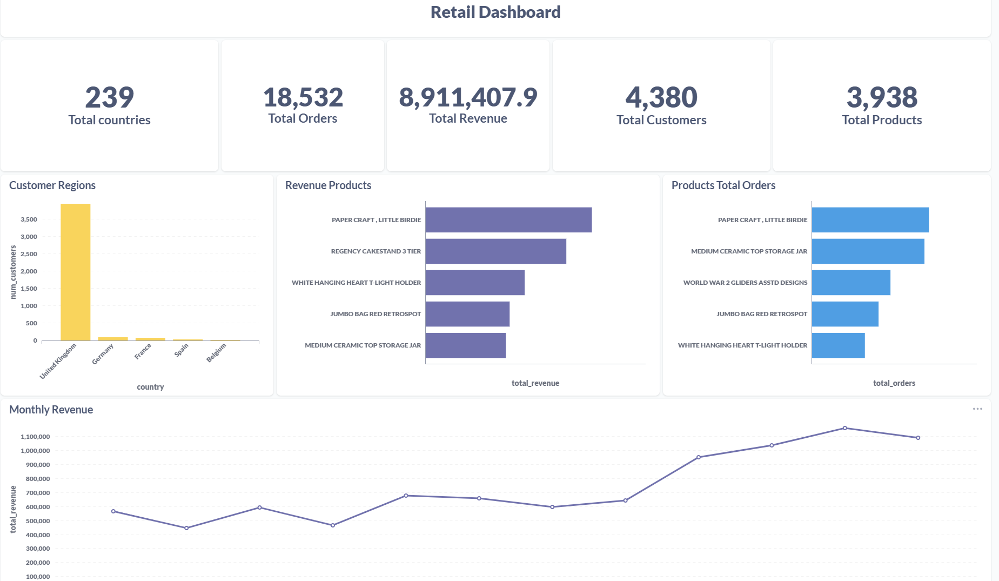

Overview
========

This is a robust and scalable data pipeline project built using Astro CLI, Apache Airflow, dbt, Google Cloud Storage (GCS), and BigQuery. This pipeline is designed to automate data ingestion, transformation, and loading while ensuring maintainability, scalability, and observability.

The workflow involves orchestrating data movement using Airflow, transforming datasets with dbt, leveraging cloud storage for staging, and efficiently querying structured data using BigQuery. 

Set Up & Installation
=====================
- Prerequisites (Python, Cloud SDK, dbt, etc.)
- Installing Astro CLI & setting up an Airflow environment
- Configuring Google Cloud credentials
- Setting up BigQuery & GCS buckets

Data Pipeline
================

Airflow Dags
================

Data Modelling
================

Dashboard Metabase
================

Project Contents
================
Your Astro project contains the following files and folders:

- dags: This folder contains the Python files for your Airflow DAGs. This DAG has a task retail.py that has 4 sub task. The task uses various operators to schedule the different task. 
- Dockerfile: This file contains a versioned Astro Runtime Docker image that provides a differentiated Airflow experience. It also contains dbt installed in a virtual environment 
- include: This folder contains any additional files that you want to include as part of your project. It has the dbt folder and dataset folder. The dataset folder houses the raw dataset moved to GCS, while the dbt folder contains dbt models, yaml files, cosmos file, and dependancies.
- packages.txt: OS-level packages needed for this project can be found here, it is empty since none was needed.
- requirements.txt: Python packages needed for this project can be found here; the astronomer-cosmos package/version used for this project can be found here.
- plugins: Add custom or community plugins for your project to this file. It is empty by default.
- airflow_settings.yaml: Use this local-only file to specify Airflow Connections, Variables, and Pools instead of entering them in the Airflow UI as you develop DAGs in this project.

Deploy Your Project Locally
===========================

1. Start Airflow on your local machine by running 'astro dev start --wait 5m'. the wait flag tells helps the increase the startup time

This command will spin up 4 Docker containers on your machine, each for a different Airflow component:

- Postgres: Airflow's Metadata Database
- Webserver: The Airflow component responsible for rendering the Airflow UI
- Scheduler: The Airflow component responsible for monitoring and triggering tasks
- Triggerer: The Airflow component responsible for triggering deferred tasks

2. Verify that all 4 Docker containers were created by running 'docker ps'.

Note: Running 'astro dev start' will start your project with the Airflow Webserver exposed at port 8080 and Postgres exposed at port 5432. You might get an error if you have anything running on any of these ports already.

3. Access the Airflow UI for your local Airflow project. To do so, go to http://localhost:8080/ and log in with 'admin' for both your Username and Password.

You should also be able to access your Postgres Database at 'localhost:5432/postgres'.

